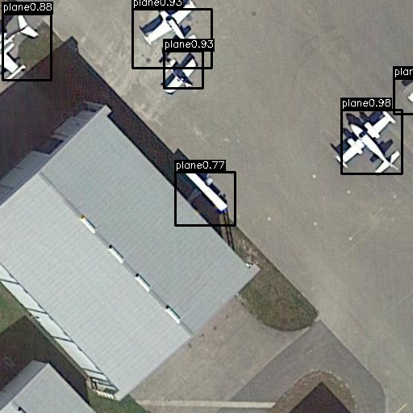

# YOLOv1 for aerial imagess
This is a pytorch implementation of YOLOv1
&nbsp;

# Usage

### Dataset
    bash get_dataset.sh

### Train
    bash train.sh

### Predict
    mkdir predict_label
    bash predict.sh 
    
### Visualization
To visualization the ground truth or predicted bounding boxes in an image, you can run the provided visualization script provided in the starter code by using the following command.
    python3 visualize_bbox.py <image.jpg> <label.txt>

### Demo

